# Fit For Life - Testing Document

## Testing and Debugging
* Python: I used the built-in Python debugger in Visual Studio to debug my Python. I set breakpoints to see where certain functions/code was failing. This was a really useful tool throughout the development of this project as it supports debug pf both Django template code and the python code. 
* I used [ExtendsClass.com](https://extendsclass.com/) to validate my python code. No syntax errors were detected.
* HTML & CSS: In order to validate my HTML & CSS I availed of [W3C Validator](https://validator.w3.org/) which returned no errors.
* Javascript: I used [Esprima](https://esprima.org/) to validate my javascript and no errors were returned. I used the console on chrome to help debug my Javascript code.
* Responsive: To test if the website was responsive I used the following [website](http://ami.responsivedesign.is/) - the website was responsive across all screen sizes. 
* Python Logger: I also used the python logger app to help debug my python code.

### Bugs encountered during Testing
#### Webhook
One bug I encountered during testing was with the Webhook. It kept returning a “warning, not found” error. After investigation, two issues were found:
* The route to the Webhook code was incorrectly specified on the Stripe Webhook configuration.
* In copying the Webhook secret key I had accidental copies an extra blank space at the end of the key.
Debugging these issues involved the Stripe testing facilities on their dashboard and instrumenting the Webhook code in my application.


#### Case Sensitivity
I also resolved several bugs due to mixed case in the reference to objects like Products, Plans etc.

### Copy and Paste Errors
When creating my unit tests I found numerous copy and paste errors that resulted from reusing code between Apps.

#### Email
When testing the contact form I found that the gmail SMTP server was blocking emails from what it regarded as a ‘third party app’. I had to disable some checking on the account for this to work correctly: (https://accounts.google.com/b/0/DisplayUnlockCaptcha)

### Testing CRUD functionailties
* **Create**: Users can create an account / Admin (Super Users) can add products.
* **Read**: All products, plans and user details are pulled from the database.
* **Update**: Users have the option to update their user information (delivery address information).
* **Delete**: super users can delete products, users can delete items from cart.

## General Testing
* I tested all the navigation links repeatedly to guarantee that they worked from each individual page.
* I loaded pages several times to verify that the images loaded perfectly every time, as well as establishing that images appeared zoomed if they were designed to do so.
* I confirmed that all buttons on the site performed the task that they were set out to, E.G; the see more button loaded the product details page
* The HTML and CSS were validated on W3, there were 16 errors found in total. However, all errors were successfully corrected.

## Testing User Stories:
### Admin User
**As a site Admin I want to be able to create, edit and delete new products and plans**  
Once an admin user signs in they can select a drop down called Add Product from “my account” on the Navbar which brings them to a page only accessible to admin/superusers where they can add a new product  
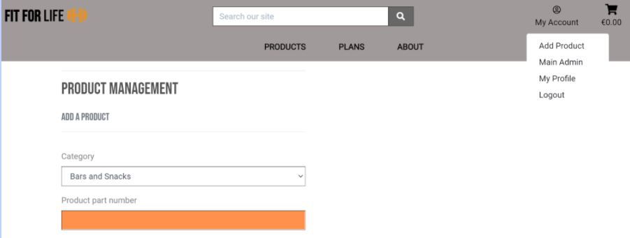  
**As an admin I want to be able to edit/update products and plans.**  
Admin/Superusers are able to edit/update product information straight from the products page - once they have clicked the See-More button, they are brought to the products page where they have an option to edit the product  
Similarly with the plans page: a Admin/Superuser can edit or delete a plan. More low level modification of plans and associated workouts is facilitated in the Admin portion of the site which can be reached by an Admin/Superuser from the main menu.  
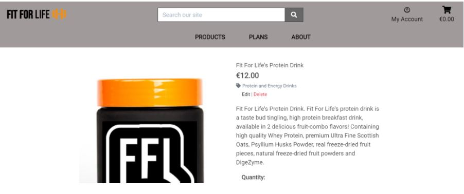  
**As an admin I want the ability to delete products/plans.**  
Similar to the above - admin/superusers can delete products on the individual product page  
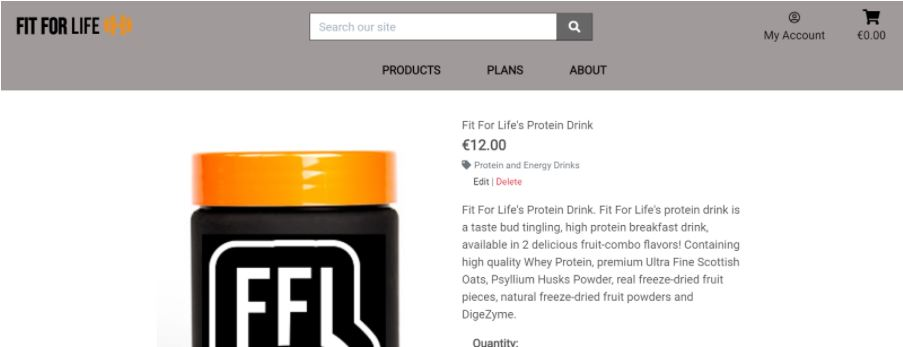  
An admin/superusers can delete and edit plans on the individual plans page.  
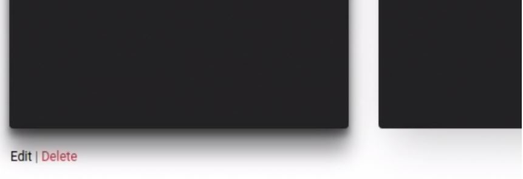  
### Registered User
**As a registered user I want to be able to login.**
Registered users have the option to login by clicking on “my account” on the Navbar.  
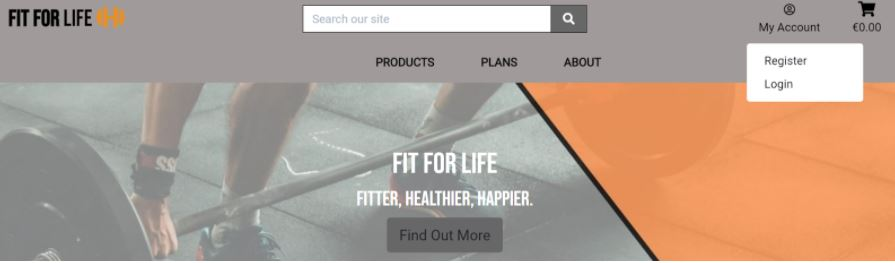  
They are then brought to the “sign in” page  
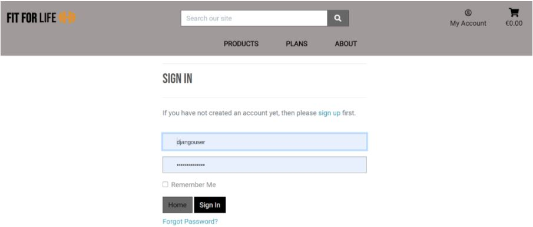  
**As a registered user I want to be able to update and save my information.**  
Registered users have the option to update and save their delivery information on their profile page.  
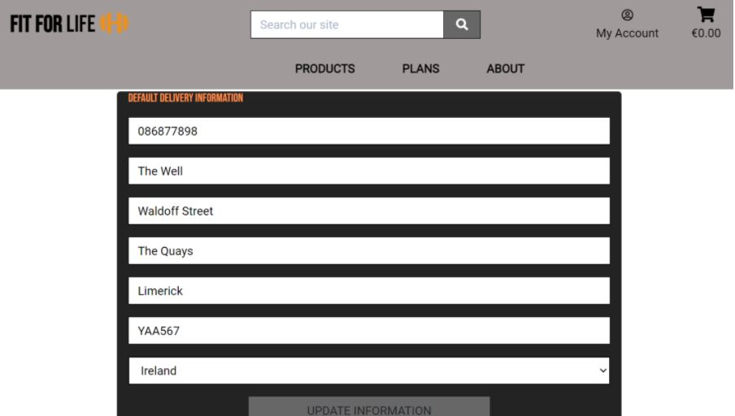  
**As a registered user I want to be able to see my previous purchases.**  
Registered users can also view their previous purchases on their profile page under the order history section.  
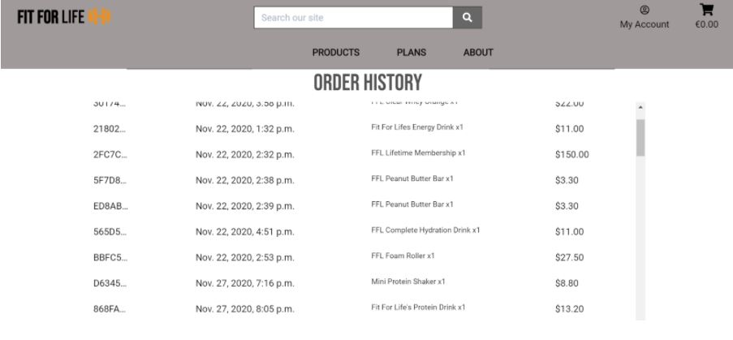  
**As a registered user who has purchased membership I want to be able to view fitness plans.**
Registered users can view a range of fitness plans that are exclusive to users who have purchased membership; these are available to view by clicking on the plans tab.  
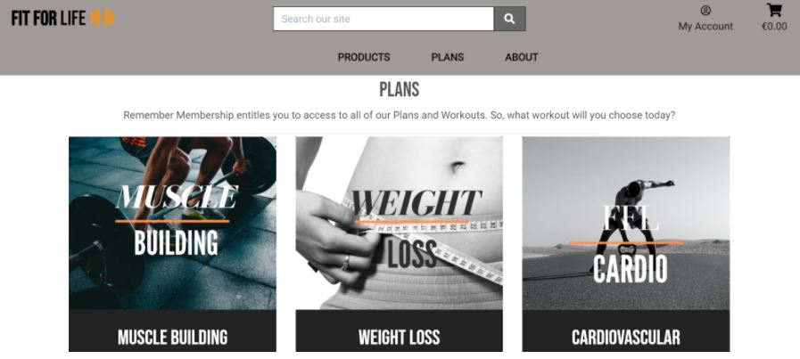   
**As a registered user I want to be able to buy products with a member discount.**  
Once a member goes to the checkout, their discount is automatically applied.  
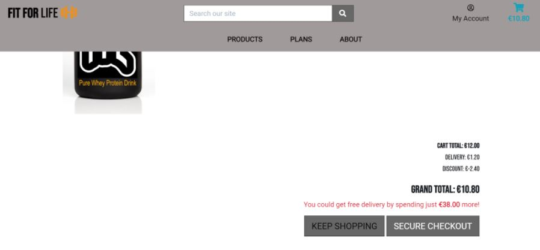  
### Non-Registered User
**As a non-registered user I want to be able to Navigate to different pages of the website .**  
Non-registered users can navigate the site by using the navbar.  
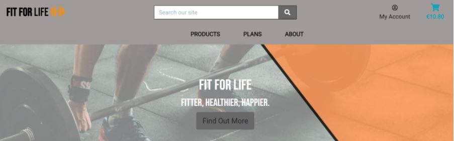  
**As a non-registered user I want to be able to browse products.**  
Non-registered users can browse all products by selecting it on the navbar.  
  
**As a non-registered user I want to be able to buy products.**  
Non-registered users can purchase products but they do not receive a discount.  
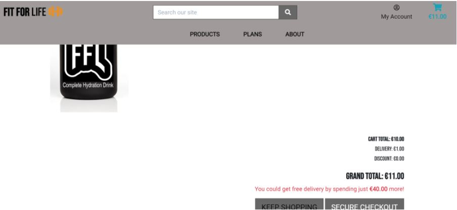  
**As a non-registered user I want to be able to search for products.**  
Non-registered users can search for products by using the search box on the navbar.  
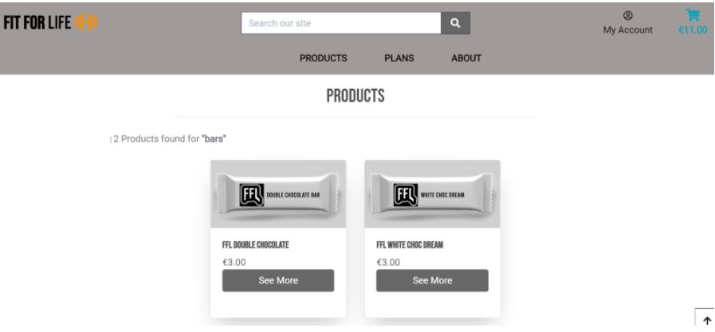

#### Testing Django
The test strategy for this project uses Django's built in test framework described in the Django documentation https://docs.djangoproject.com/en/3.1/topics/testing/#

Each Application has a test folder with tests for Views, Models and Forms. Tests can be invoked through a shell script as follows:
```
#!/bin/bash
source ../shell_scripts/environment.sh
export USE_TEST_DATABASE="True"
unset DATABASE_URL
if [ $# -eq 1 ]; then
    echo "[$#]: Verbose mode selected"
    VERBOSE=1
fi
cd ..
if [ "$VERBOSE" == "1" ]; then
    echo "[$#]: Running in Verbose mode"
    python3 manage.py test products plans workouts planworkouts about profiles -v 2
else
    echo "[$#]: Running in normal mode"
    python3 manage.py test  products plans workouts planworkouts about profiles
fi   
```
The tests can run in silent or verbose mode. Verbose mode proved essential in debugging failing tests.
A shell script provides environment variables that are tailored to the unit tests.

#### Structure of Test Files
```
├── about
│   └── tests
│       ├── test_forms.py
│       ├── test_models.py
│       └── test_views.py
├── plans
│   └── tests
│       ├── test_forms.py
│       ├── test_models.py
│       └── test_views.py
├── planworkouts
│   └── tests
│       ├── test_models.py
│       └── test_views.py
├── products
│   └── tests
│       ├── test_forms.py
│       ├── test_models.py
│       └── test_views.py
├── profiles
│   └── tests
│       ├── test_forms.py
│       ├── test_models.py
│       └── test_views.py
├── shell_scripts
│   └── test_environment.sh
└── workouts
    └── tests
        ├── test_forms.py
        ├── test_models.py
        └── test_views.py
```


